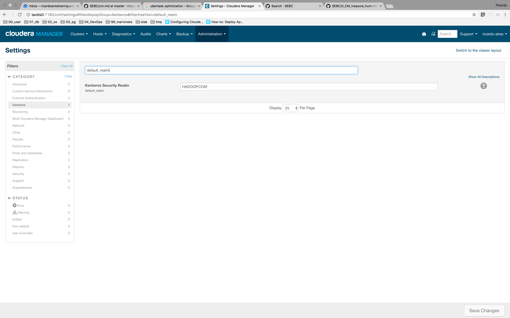

# Treasure Hunt

1. What is `ubertask` optimization?

    Option to run "sufficiently small" jobs sequentially within a single JVM.

1. Where in CM is the Kerberos Security Realm value displayed?

   Under the `Administration` menu go to `Settings` and filter by `Kerberos`.

   

1. Which CDH service(s) host a property for enabling Kerberos authentication?

   Every service, including CM, has at least one property to setup Kerberos authentication.

1. How do you upgrade the CM agents?

   After upgrading the Cloudera Manager you can upgrade the CM agents either using Cloudera Manager or by manually upgrading the packages.

1. Give the `tsquery` statement used to chart Hue's CPU utilization?

    ```code
    SELECT stats(cpu_user_rate, counter) + stats(cpu_system_rate, counter) WHERE roleType=HUE_SERVER
    ```

1. Name all the roles that make up the Hive service.

    - Hive Metastore Server
    - WebHCat Server
    - HiveServer2
    - Gateway

1. What steps must be completed before integrating Cloudera Manager with Kerberos?

    - Set up a working KDC.
    - Configure the KDC to allow renewable tickets with non-zero ticket lifetimes.
    - Install the OS-specific packages for your cluster.
    - Create an account for Cloudera Manager that has the permissions to create other accounts in the KDC.