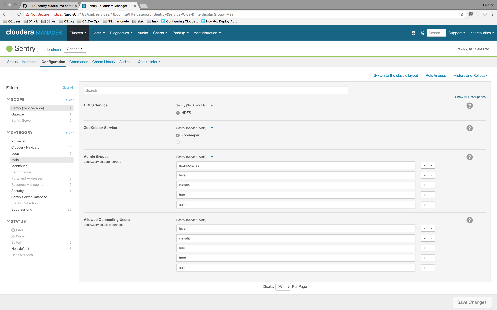

# A Quick Sentry Tutorial

## Configure Sentry to recognize your githandler account as an administrator

1. Add your test user's primary  group to the `sentry.service.admin.group` list in CM.

    

1. Verify user privileges

    ```code
    $ kinit ricardo-aires -p
    Password for ricardo-aires@SEBC.COM: 
    $ klist
    Ticket cache: FILE:/tmp/krb5cc_500
    Default principal: ricardo-aires@SEBC.COM

    Valid starting     Expires            Service principal
    03/09/17 10:20:11  03/10/17 10:20:11  krbtgt/SEBC.COM@SEBC.COM
    	renew until 03/16/17 10:20:11
    $ 
    ```

1. Use `beeline` to confirm your principal sees no tables.

    ```code
    $ beeline -u "jdbc:hive2://localhost:10000/default;principal=hive/ip-172-31-16-248.eu-west-1.compute.internal@REALM.COM"
    scan complete in 4ms
    Connecting to jdbc:hive2://localhost:10000/default;principal=hive/ip-172-31-16-248.eu-west-1.compute.internal@REALM.COM
    Connected to: Apache Hive (version 1.1.0-cdh5.8.4)
    Driver: Hive JDBC (version 1.1.0-cdh5.8.4)
    Transaction isolation: TRANSACTION_REPEATABLE_READ
    Beeline version 1.1.0-cdh5.8.4 by Apache Hive
    0: jdbc:hive2://localhost:10000/default> show tables;
    INFO  : Compiling command(queryId=hive_20170309102424_9233177f-b7e8-4ee6-91cc-a6a58474cf3b): show tables
    INFO  : Semantic Analysis Completed
    INFO  : Returning Hive schema: Schema(fieldSchemas:[FieldSchema(name:tab_name, type:string, comment:from deserializer)], properties:null)
    INFO  : Completed compiling command(queryId=hive_20170309102424_9233177f-b7e8-4ee6-91cc-a6a58474cf3b); Time taken: 0.795 seconds
    INFO  : Executing command(queryId=hive_20170309102424_9233177f-b7e8-4ee6-91cc-a6a58474cf3b): show tables
    INFO  : Starting task [Stage-0:DDL] in serial mode
    INFO  : Completed executing command(queryId=hive_20170309102424_9233177f-b7e8-4ee6-91cc-a6a58474cf3b); Time taken: 0.27 seconds
    INFO  : OK
    +-----------+--+
    | tab_name  |
    +-----------+--+
    +-----------+--+
    No rows selected (2.4 seconds)
    0: jdbc:hive2://localhost:10000/default> 
    ```

1. Create a Sentry role with full authorization 

    ```code
    0: jdbc:hive2://localhost:10000/default> CREATE ROLE sentry_admin;
    INFO  : Compiling command(queryId=hive_20170309102828_925a83ac-9467-4814-9d5e-23037d66dc15): CREATE ROLE sentry_admin
    INFO  : Semantic Analysis Completed
    INFO  : Returning Hive schema: Schema(fieldSchemas:null, properties:null)
    INFO  : Completed compiling command(queryId=hive_20170309102828_925a83ac-9467-4814-9d5e-23037d66dc15); Time taken: 0.067 seconds
    INFO  : Executing command(queryId=hive_20170309102828_925a83ac-9467-4814-9d5e-23037d66dc15): CREATE ROLE sentry_admin
    INFO  : Starting task [Stage-0:DDL] in serial mode
    INFO  : Completed executing command(queryId=hive_20170309102828_925a83ac-9467-4814-9d5e-23037d66dc15); Time taken: 0.77 seconds
    INFO  : OK
    No rows affected (0.899 seconds)
    0: jdbc:hive2://localhost:10000/default> GRANT ALL ON SERVER server1 TO ROLE sentry_admin;
    INFO  : Compiling command(queryId=hive_20170309102828_100da550-fa1d-4cc7-ac82-22a0e6917e18): GRANT ALL ON SERVER server1 TO ROLE sentry_admin
    INFO  : Semantic Analysis Completed
    INFO  : Returning Hive schema: Schema(fieldSchemas:null, properties:null)
    INFO  : Completed compiling command(queryId=hive_20170309102828_100da550-fa1d-4cc7-ac82-22a0e6917e18); Time taken: 0.113 seconds
    INFO  : Executing command(queryId=hive_20170309102828_100da550-fa1d-4cc7-ac82-22a0e6917e18): GRANT ALL ON SERVER server1 TO ROLE sentry_admin
    INFO  : Starting task [Stage-0:DDL] in serial mode
    INFO  : Completed executing command(queryId=hive_20170309102828_100da550-fa1d-4cc7-ac82-22a0e6917e18); Time taken: 0.104 seconds
    INFO  : OK
    No rows affected (0.226 seconds)
    0: jdbc:hive2://localhost:10000/default> GRANT ROLE sentry_admin TO GROUP `ricardo-aires`;
    INFO  : Compiling command(queryId=hive_20170309103333_987acb7d-6962-4ab7-bff7-a4e59222a61d): GRANT ROLE sentry_admin TO GROUP `ricardo-aires`
    INFO  : Semantic Analysis Completed
    INFO  : Returning Hive schema: Schema(fieldSchemas:null, properties:null)
    INFO  : Completed compiling command(queryId=hive_20170309103333_987acb7d-6962-4ab7-bff7-a4e59222a61d); Time taken: 0.077 seconds
    INFO  : Executing command(queryId=hive_20170309103333_987acb7d-6962-4ab7-bff7-a4e59222a61d): GRANT ROLE sentry_admin TO GROUP `ricardo-aires`
    INFO  : Starting task [Stage-0:DDL] in serial mode
    INFO  : Completed executing command(queryId=hive_20170309103333_987acb7d-6962-4ab7-bff7-a4e59222a61d); Time taken: 0.109 seconds
    INFO  : OK
    No rows affected (0.194 seconds)
    0: jdbc:hive2://localhost:10000/default> SHOW TABLES;
    INFO  : Compiling command(queryId=hive_20170309103434_a08bbde7-8b0f-49e1-91d2-bd558b501775): SHOW TABLES
    INFO  : Semantic Analysis Completed
    INFO  : Returning Hive schema: Schema(fieldSchemas:[FieldSchema(name:tab_name, type:string, comment:from deserializer)], properties:null)
    INFO  : Completed compiling command(queryId=hive_20170309103434_a08bbde7-8b0f-49e1-91d2-bd558b501775); Time taken: 0.069 seconds
    INFO  : Executing command(queryId=hive_20170309103434_a08bbde7-8b0f-49e1-91d2-bd558b501775): SHOW TABLES
    INFO  : Starting task [Stage-0:DDL] in serial mode
    INFO  : Completed executing command(queryId=hive_20170309103434_a08bbde7-8b0f-49e1-91d2-bd558b501775); Time taken: 0.176 seconds
    INFO  : OK
    +------------+--+
    |  tab_name  |
    +------------+--+
    | customers  |
    | sample_07  |
    | sample_08  |
    | web_logs   |
    +------------+--+
    4 rows selected (0.354 seconds)
    0: jdbc:hive2://localhost:10000/default> 
    ```

## Create additional test users

1. Add new users to all cluster nodes

    ```code
    $ groupadd selector
    $ groupadd inserters
    $ useradd -u 1100 -g selector george
    $ useradd -u 1200 -g inserters ferdinand
    $ kadmin -p cloudera-scm
    Authenticating as principal cloudera-scm with password.
    Password for cloudera-scm@SEBC.COM: 
    kadmin:  add_principal george
    WARNING: no policy specified for george@SEBC.COM; defaulting to no policy
    Enter password for principal "george@SEBC.COM": 
    Re-enter password for principal "george@SEBC.COM": 
    Principal "george@SEBC.COM" created.
    kadmin:  add_principal ferdinand
    WARNING: no policy specified for ferdinand@SEBC.COM; defaulting to no policy
    Enter password for principal "ferdinand@SEBC.COM": 
    Re-enter password for principal "ferdinand@SEBC.COM": 
    Principal "ferdinand@SEBC.COM" created.
    kadmin:  exit
    $ 
    ```

1. Create test roles

    ```code
    0: jdbc:hive2://localhost:10000/default> CREATE ROLE reads;
    INFO  : Compiling command(queryId=hive_20170309105252_d73062be-6cbd-41be-84e2-c047d9f3e4cb): CREATE ROLE reads
    INFO  : Semantic Analysis Completed
    INFO  : Returning Hive schema: Schema(fieldSchemas:null, properties:null)
    INFO  : Completed compiling command(queryId=hive_20170309105252_d73062be-6cbd-41be-84e2-c047d9f3e4cb); Time taken: 0.073 seconds
    INFO  : Executing command(queryId=hive_20170309105252_d73062be-6cbd-41be-84e2-c047d9f3e4cb): CREATE ROLE reads
    INFO  : Starting task [Stage-0:DDL] in serial mode
    INFO  : Completed executing command(queryId=hive_20170309105252_d73062be-6cbd-41be-84e2-c047d9f3e4cb); Time taken: 0.044 seconds
    INFO  : OK
    No rows affected (0.179 seconds)
    0: jdbc:hive2://localhost:10000/default> CREATE ROLE writes;
    INFO  : Compiling command(queryId=hive_20170309105252_946bc47c-0adb-4273-be9c-506596a5c7fa): CREATE ROLE writes
    INFO  : Semantic Analysis Completed
    INFO  : Returning Hive schema: Schema(fieldSchemas:null, properties:null)
    INFO  : Completed compiling command(queryId=hive_20170309105252_946bc47c-0adb-4273-be9c-506596a5c7fa); Time taken: 0.082 seconds
    INFO  : Executing command(queryId=hive_20170309105252_946bc47c-0adb-4273-be9c-506596a5c7fa): CREATE ROLE writes
    INFO  : Starting task [Stage-0:DDL] in serial mode
    INFO  : Completed executing command(queryId=hive_20170309105252_946bc47c-0adb-4273-be9c-506596a5c7fa); Time taken: 0.04 seconds
    INFO  : OK
    No rows affected (0.133 seconds)
    0: jdbc:hive2://localhost:10000/default> 
    ```

1. Grant read privilege for all tables to `reads`

    ```code
    0: jdbc:hive2://localhost:10000/default> GRANT SELECT ON DATABASE default TO ROLE reads;
    INFO  : Compiling command(queryId=hive_20170309105353_c28b919e-65fb-4559-b12f-80ef76352de3): GRANT SELECT ON DATABASE default TO ROLE reads
    INFO  : Semantic Analysis Completed
    INFO  : Returning Hive schema: Schema(fieldSchemas:null, properties:null)
    INFO  : Completed compiling command(queryId=hive_20170309105353_c28b919e-65fb-4559-b12f-80ef76352de3); Time taken: 0.088 seconds
    INFO  : Executing command(queryId=hive_20170309105353_c28b919e-65fb-4559-b12f-80ef76352de3): GRANT SELECT ON DATABASE default TO ROLE reads
    INFO  : Starting task [Stage-0:DDL] in serial mode
    INFO  : Completed executing command(queryId=hive_20170309105353_c28b919e-65fb-4559-b12f-80ef76352de3); Time taken: 0.046 seconds
    INFO  : OK
    No rows affected (0.142 seconds)
    0: jdbc:hive2://localhost:10000/default> GRANT ROLE reads TO GROUP selector;
    INFO  : Compiling command(queryId=hive_20170309105353_82d9480f-5dc8-4d85-a9b8-60bcb8abf30f): GRANT ROLE reads TO GROUP selector
    INFO  : Semantic Analysis Completed
    INFO  : Returning Hive schema: Schema(fieldSchemas:null, properties:null)
    INFO  : Completed compiling command(queryId=hive_20170309105353_82d9480f-5dc8-4d85-a9b8-60bcb8abf30f); Time taken: 0.058 seconds
    INFO  : Executing command(queryId=hive_20170309105353_82d9480f-5dc8-4d85-a9b8-60bcb8abf30f): GRANT ROLE reads TO GROUP selector
    INFO  : Starting task [Stage-0:DDL] in serial mode
    INFO  : Completed executing command(queryId=hive_20170309105353_82d9480f-5dc8-4d85-a9b8-60bcb8abf30f); Time taken: 0.042 seconds
    INFO  : OK
    No rows affected (0.108 seconds)
    0: jdbc:hive2://localhost:10000/default>
    ```

1. Grant read privilege for `default.sample07` only to 'writes'

    ```code
    0: jdbc:hive2://localhost:10000/default> REVOKE ALL ON DATABASE default FROM ROLE writes;
    INFO  : Compiling command(queryId=hive_20170309105454_36a4da07-6264-47f9-a604-8459b7521a60): REVOKE ALL ON DATABASE default FROM ROLE writes
    INFO  : Semantic Analysis Completed
    INFO  : Returning Hive schema: Schema(fieldSchemas:null, properties:null)
    INFO  : Completed compiling command(queryId=hive_20170309105454_36a4da07-6264-47f9-a604-8459b7521a60); Time taken: 0.063 seconds
    INFO  : Executing command(queryId=hive_20170309105454_36a4da07-6264-47f9-a604-8459b7521a60): REVOKE ALL ON DATABASE default FROM ROLE writes
    INFO  : Starting task [Stage-0:DDL] in serial mode
    INFO  : Completed executing command(queryId=hive_20170309105454_36a4da07-6264-47f9-a604-8459b7521a60); Time taken: 0.096 seconds
    INFO  : OK
    No rows affected (0.168 seconds)
    0: jdbc:hive2://localhost:10000/default> GRANT SELECT ON default.sample_07 TO ROLE writes;
    INFO  : Compiling command(queryId=hive_20170309105454_514e3684-5ac8-459b-a951-44ce5961a926): GRANT SELECT ON default.sample_07 TO ROLE writes
    INFO  : Semantic Analysis Completed
    INFO  : Returning Hive schema: Schema(fieldSchemas:null, properties:null)
    INFO  : Completed compiling command(queryId=hive_20170309105454_514e3684-5ac8-459b-a951-44ce5961a926); Time taken: 0.061 seconds
    INFO  : Executing command(queryId=hive_20170309105454_514e3684-5ac8-459b-a951-44ce5961a926): GRANT SELECT ON default.sample_07 TO ROLE writes
    INFO  : Starting task [Stage-0:DDL] in serial mode
    INFO  : Completed executing command(queryId=hive_20170309105454_514e3684-5ac8-459b-a951-44ce5961a926); Time taken: 0.047 seconds
    INFO  : OK
    No rows affected (0.116 seconds)
    0: jdbc:hive2://localhost:10000/default> GRANT ROLE writes TO GROUP inserters;
    INFO  : Compiling command(queryId=hive_20170309105454_21a4c529-fc19-4ac8-be92-1a3dceade6b8): GRANT ROLE writes TO GROUP inserters
    INFO  : Semantic Analysis Completed
    INFO  : Returning Hive schema: Schema(fieldSchemas:null, properties:null)
    INFO  : Completed compiling command(queryId=hive_20170309105454_21a4c529-fc19-4ac8-be92-1a3dceade6b8); Time taken: 0.07 seconds
    INFO  : Executing command(queryId=hive_20170309105454_21a4c529-fc19-4ac8-be92-1a3dceade6b8): GRANT ROLE writes TO GROUP inserters
    INFO  : Starting task [Stage-0:DDL] in serial mode
    INFO  : Completed executing command(queryId=hive_20170309105454_21a4c529-fc19-4ac8-be92-1a3dceade6b8); Time taken: 0.037 seconds
    INFO  : OK
    No rows affected (0.118 seconds)
    0: jdbc:hive2://localhost:10000/default>
    ```

1. `kinit` as `george`, login to beeline, and use `SHOW TABLES;`. `george` should be able to see all tables

    ```code
    $ kinit george -p
    Password for george@SEBC.COM: 
    $ beeline -u "jdbc:hive2://localhost:10000/default;principal=hive/ip-172-31-16-248.eu-west-1.compute.internal@REALM.COM"
    scan complete in 3ms
    Connecting to jdbc:hive2://localhost:10000/default;principal=hive/ip-172-31-16-248.eu-west-1.compute.internal@REALM.COM
    Connected to: Apache Hive (version 1.1.0-cdh5.8.4)
    Driver: Hive JDBC (version 1.1.0-cdh5.8.4)
    Transaction isolation: TRANSACTION_REPEATABLE_READ
    Beeline version 1.1.0-cdh5.8.4 by Apache Hive
    0: jdbc:hive2://localhost:10000/default> show tables;
    INFO  : Compiling command(queryId=hive_20170309105656_c5ba3fe6-f6c1-4cc6-9c92-f65e51e34d65): show tables
    INFO  : Semantic Analysis Completed
    INFO  : Returning Hive schema: Schema(fieldSchemas:[FieldSchema(name:tab_name, type:string, comment:from deserializer)], properties:null)
    INFO  : Completed compiling command(queryId=hive_20170309105656_c5ba3fe6-f6c1-4cc6-9c92-f65e51e34d65); Time taken: 0.075 seconds
    INFO  : Executing command(queryId=hive_20170309105656_c5ba3fe6-f6c1-4cc6-9c92-f65e51e34d65): show tables
    INFO  : Starting task [Stage-0:DDL] in serial mode
    INFO  : Completed executing command(queryId=hive_20170309105656_c5ba3fe6-f6c1-4cc6-9c92-f65e51e34d65); Time taken: 0.174 seconds
    INFO  : OK
    +------------+--+
    |  tab_name  |
    +------------+--+
    | customers  |
    | sample_07  |
    | sample_08  |
    | web_logs   |
    +------------+--+
    4 rows selected (0.382 seconds)
    0: jdbc:hive2://localhost:10000/default>
    ```

1. Repeat the process as `ferdinand`, `ferdinand` should see `sample_07`.

    ```code
    $ kinit ferdinand -p
    Password for ferdinand@SEBC.COM: 
    $ beeline -u "jdbc:hive2://localhost:10000/default;principal=hive/ip-172-31-16-248.eu-west-1.compute.internal@REALM.COM"
    scan complete in 3ms
    Connecting to jdbc:hive2://localhost:10000/default;principal=hive/ip-172-31-16-248.eu-west-1.compute.internal@REALM.COM
    Connected to: Apache Hive (version 1.1.0-cdh5.8.4)
    Driver: Hive JDBC (version 1.1.0-cdh5.8.4)
    Transaction isolation: TRANSACTION_REPEATABLE_READ
    Beeline version 1.1.0-cdh5.8.4 by Apache Hive
    0: jdbc:hive2://localhost:10000/default> show tables;
    INFO  : Compiling command(queryId=hive_20170309105858_03088d07-2d49-4907-890d-b77952687edb): show tables
    INFO  : Semantic Analysis Completed
    INFO  : Returning Hive schema: Schema(fieldSchemas:[FieldSchema(name:tab_name, type:string, comment:from deserializer)], properties:null)
    INFO  : Completed compiling command(queryId=hive_20170309105858_03088d07-2d49-4907-890d-b77952687edb); Time taken: 0.072 seconds
    INFO  : Executing command(queryId=hive_20170309105858_03088d07-2d49-4907-890d-b77952687edb): show tables
    INFO  : Starting task [Stage-0:DDL] in serial mode
    INFO  : Completed executing command(queryId=hive_20170309105858_03088d07-2d49-4907-890d-b77952687edb); Time taken: 0.145 seconds
    INFO  : OK
    +------------+--+
    |  tab_name  |
    +------------+--+
    | sample_07  |
    +------------+--+
    1 row selected (0.349 seconds)
    0: jdbc:hive2://localhost:10000/default> 
    ```
