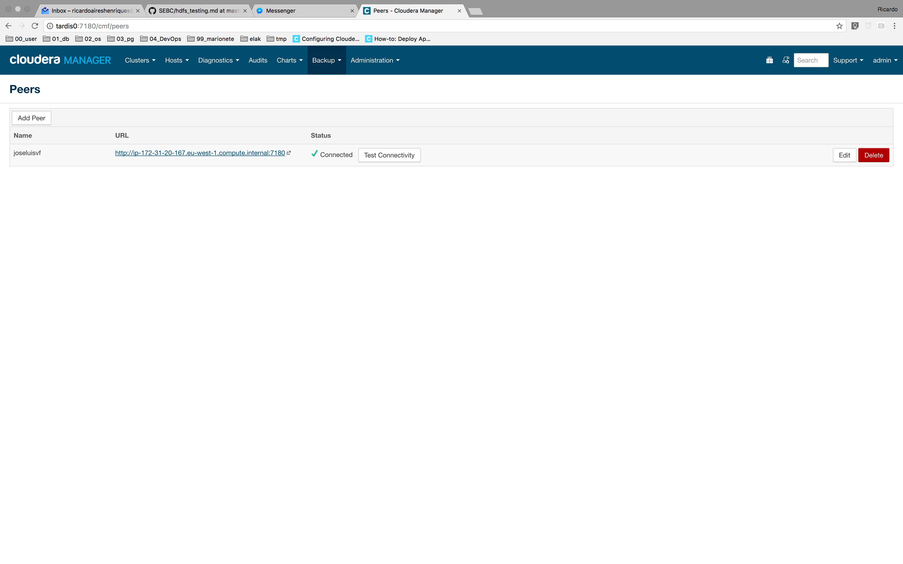
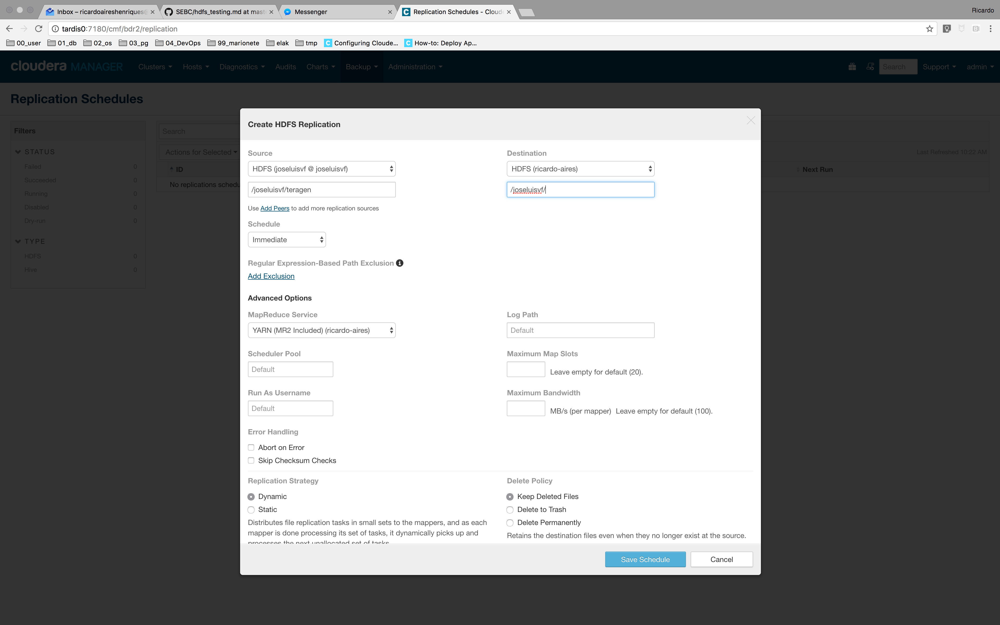
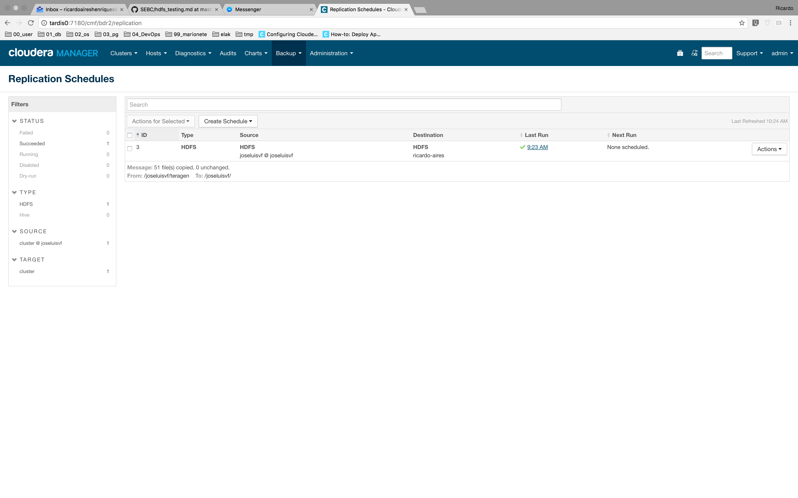

# Replicate to another cluster

1. Choose a partner in class

    This lab was executed in collaboration with José Valle-Flor, GitHub handler `joseluivf`

1. Name a source directory after your GitHub handler

    ```code
    hdfs dfs -mkdir /ricardo-aires
    ````

1. Name a target directory after your partner's GitHub handle

    ```code
    hdfs dfs -mkdir /joseluivf
    ````

1. Use teragen to create a 500 MB file

    ```code
    hadoop jar /opt/cloudera/parcels/CDH/lib/hadoop-0.20-mapreduce/hadoop-examples.jar teragen \
    > -Dmapreduce.job.maps=50 \
    > -Dmapreduce.map.speculative=false \
    > 5242880 /ricardo-aires/teragen
    ```

1. Copy your partner's file to your target directory

    - My partner used the next `distcp` command to copy my file into his cluster:

        ```code
        hadoop distcp hdfs://ip-172-31-16-248.eu-west-1.compute.internal:8020/ricardo-aires/teragen \
        hdfs://ip-172-31-18-176.eu-west-1.compute.internal:8020/joseluisvf
        ```

    - For me to used the `BDR` I've:

        1. Added his cluster as a Peer

            

        1. Added a new HDFS Replication Scheduler

            

        1. Waited till finish.

            

1. Browse the results

    ```code
    $ hdfs dfs -ls /ricardo-aires/
    Found 1 items
    drwxr-xr-x   - hdfs supergroup          0 2017-03-07 09:57 /ricardo-aires/teragen
    $ hdfs dfs -ls /joseluisvf/
    Found 1 items
    drwxr-xr-x   - hdfs supergroup          0 2017-03-07 10:22 /joseluisvf/teragen
    $ hdfs dfs -du -h /ricardo-aires/
    500 M  1.5 G  /ricardo-aires/teragen
    $ hdfs dfs -du -h /joseluisvf/
    500 M  1.5 G  /joseluisvf/teragen
    $ hdfs fsck /ricardo-aires/ -files -blocks
    Connecting to namenode via http://ip-172-31-16-248.eu-west-1.compute.internal:50070
    FSCK started by hdfs (auth:SIMPLE) from /172.31.16.248 for path /ricardo-aires/ at Tue Mar 07 10:29:19 UTC 2017
    /ricardo-aires/ <dir>
    /ricardo-aires/teragen <dir>
    /ricardo-aires/teragen/_SUCCESS 0 bytes, 0 block(s):  OK
    
    /ricardo-aires/teragen/part-m-00000 10485800 bytes, 1 block(s):  OK
    0. BP-1329094054-172.31.16.248-1488814148096:blk_1073743691_2867 len=10485800 Live_repl=3
    
    /ricardo-aires/teragen/part-m-00001 10485800 bytes, 1 block(s):  OK
    0. BP-1329094054-172.31.16.248-1488814148096:blk_1073743686_2862 len=10485800 Live_repl=3
    
    /ricardo-aires/teragen/part-m-00002 10485700 bytes, 1 block(s):  OK
    0. BP-1329094054-172.31.16.248-1488814148096:blk_1073743687_2863 len=10485700 Live_repl=3
    
    /ricardo-aires/teragen/part-m-00003 10485800 bytes, 1 block(s):  OK
    0. BP-1329094054-172.31.16.248-1488814148096:blk_1073743684_2860 len=10485800 Live_repl=3
    
    /ricardo-aires/teragen/part-m-00004 10485700 bytes, 1 block(s):  OK
    0. BP-1329094054-172.31.16.248-1488814148096:blk_1073743690_2866 len=10485700 Live_repl=3
    
    /ricardo-aires/teragen/part-m-00005 10485800 bytes, 1 block(s):  OK
    0. BP-1329094054-172.31.16.248-1488814148096:blk_1073743688_2864 len=10485800 Live_repl=3
    
    /ricardo-aires/teragen/part-m-00006 10485800 bytes, 1 block(s):  OK
    0. BP-1329094054-172.31.16.248-1488814148096:blk_1073743685_2861 len=10485800 Live_repl=3
    
    /ricardo-aires/teragen/part-m-00007 10485700 bytes, 1 block(s):  OK
    0. BP-1329094054-172.31.16.248-1488814148096:blk_1073743689_2865 len=10485700 Live_repl=3
    
    /ricardo-aires/teragen/part-m-00008 10485800 bytes, 1 block(s):  OK
    0. BP-1329094054-172.31.16.248-1488814148096:blk_1073743692_2868 len=10485800 Live_repl=3
    
    /ricardo-aires/teragen/part-m-00009 10485700 bytes, 1 block(s):  OK
    0. BP-1329094054-172.31.16.248-1488814148096:blk_1073743681_2857 len=10485700 Live_repl=3
    
    /ricardo-aires/teragen/part-m-00010 10485800 bytes, 1 block(s):  OK
    0. BP-1329094054-172.31.16.248-1488814148096:blk_1073743682_2858 len=10485800 Live_repl=3
    
    /ricardo-aires/teragen/part-m-00011 10485800 bytes, 1 block(s):  OK
    0. BP-1329094054-172.31.16.248-1488814148096:blk_1073743683_2859 len=10485800 Live_repl=3
    
    /ricardo-aires/teragen/part-m-00012 10485700 bytes, 1 block(s):  OK
    0. BP-1329094054-172.31.16.248-1488814148096:blk_1073743696_2872 len=10485700 Live_repl=3
    
    /ricardo-aires/teragen/part-m-00013 10485800 bytes, 1 block(s):  OK
    0. BP-1329094054-172.31.16.248-1488814148096:blk_1073743695_2871 len=10485800 Live_repl=3
    
    /ricardo-aires/teragen/part-m-00014 10485700 bytes, 1 block(s):  OK
    0. BP-1329094054-172.31.16.248-1488814148096:blk_1073743697_2873 len=10485700 Live_repl=3
    
    /ricardo-aires/teragen/part-m-00015 10485800 bytes, 1 block(s):  OK
    0. BP-1329094054-172.31.16.248-1488814148096:blk_1073743701_2877 len=10485800 Live_repl=3
    
    /ricardo-aires/teragen/part-m-00016 10485800 bytes, 1 block(s):  OK
    0. BP-1329094054-172.31.16.248-1488814148096:blk_1073743702_2878 len=10485800 Live_repl=3
    
    /ricardo-aires/teragen/part-m-00017 10485700 bytes, 1 block(s):  OK
    0. BP-1329094054-172.31.16.248-1488814148096:blk_1073743700_2876 len=10485700 Live_repl=3
    
    /ricardo-aires/teragen/part-m-00018 10485800 bytes, 1 block(s):  OK
    0. BP-1329094054-172.31.16.248-1488814148096:blk_1073743703_2879 len=10485800 Live_repl=3
    
    /ricardo-aires/teragen/part-m-00019 10485700 bytes, 1 block(s):  OK
    0. BP-1329094054-172.31.16.248-1488814148096:blk_1073743705_2881 len=10485700 Live_repl=3
    
    /ricardo-aires/teragen/part-m-00020 10485800 bytes, 1 block(s):  OK
    0. BP-1329094054-172.31.16.248-1488814148096:blk_1073743698_2874 len=10485800 Live_repl=3
    
    /ricardo-aires/teragen/part-m-00021 10485800 bytes, 1 block(s):  OK
    0. BP-1329094054-172.31.16.248-1488814148096:blk_1073743699_2875 len=10485800 Live_repl=3
    
    /ricardo-aires/teragen/part-m-00022 10485700 bytes, 1 block(s):  OK
    0. BP-1329094054-172.31.16.248-1488814148096:blk_1073743706_2882 len=10485700 Live_repl=3
    
    /ricardo-aires/teragen/part-m-00023 10485800 bytes, 1 block(s):  OK
    0. BP-1329094054-172.31.16.248-1488814148096:blk_1073743704_2880 len=10485800 Live_repl=3
    
    /ricardo-aires/teragen/part-m-00024 10485700 bytes, 1 block(s):  OK
    0. BP-1329094054-172.31.16.248-1488814148096:blk_1073743707_2883 len=10485700 Live_repl=3
    
    /ricardo-aires/teragen/part-m-00025 10485800 bytes, 1 block(s):  OK
    0. BP-1329094054-172.31.16.248-1488814148096:blk_1073743708_2884 len=10485800 Live_repl=3
    
    /ricardo-aires/teragen/part-m-00026 10485800 bytes, 1 block(s):  OK
    0. BP-1329094054-172.31.16.248-1488814148096:blk_1073743710_2886 len=10485800 Live_repl=3
    
    /ricardo-aires/teragen/part-m-00027 10485700 bytes, 1 block(s):  OK
    0. BP-1329094054-172.31.16.248-1488814148096:blk_1073743709_2885 len=10485700 Live_repl=3
    
    /ricardo-aires/teragen/part-m-00028 10485800 bytes, 1 block(s):  OK
    0. BP-1329094054-172.31.16.248-1488814148096:blk_1073743714_2890 len=10485800 Live_repl=3
    
    /ricardo-aires/teragen/part-m-00029 10485700 bytes, 1 block(s):  OK
    0. BP-1329094054-172.31.16.248-1488814148096:blk_1073743711_2887 len=10485700 Live_repl=3
    
    /ricardo-aires/teragen/part-m-00030 10485800 bytes, 1 block(s):  OK
    0. BP-1329094054-172.31.16.248-1488814148096:blk_1073743713_2889 len=10485800 Live_repl=3
    
    /ricardo-aires/teragen/part-m-00031 10485800 bytes, 1 block(s):  OK
    0. BP-1329094054-172.31.16.248-1488814148096:blk_1073743716_2892 len=10485800 Live_repl=3
    
    /ricardo-aires/teragen/part-m-00032 10485700 bytes, 1 block(s):  OK
    0. BP-1329094054-172.31.16.248-1488814148096:blk_1073743717_2893 len=10485700 Live_repl=3
    
    /ricardo-aires/teragen/part-m-00033 10485800 bytes, 1 block(s):  OK
    0. BP-1329094054-172.31.16.248-1488814148096:blk_1073743718_2894 len=10485800 Live_repl=3
    
    /ricardo-aires/teragen/part-m-00034 10485700 bytes, 1 block(s):  OK
    0. BP-1329094054-172.31.16.248-1488814148096:blk_1073743712_2888 len=10485700 Live_repl=3
    
    /ricardo-aires/teragen/part-m-00035 10485800 bytes, 1 block(s):  OK
    0. BP-1329094054-172.31.16.248-1488814148096:blk_1073743715_2891 len=10485800 Live_repl=3
    
    /ricardo-aires/teragen/part-m-00036 10485800 bytes, 1 block(s):  OK
    0. BP-1329094054-172.31.16.248-1488814148096:blk_1073743719_2895 len=10485800 Live_repl=3
    
    /ricardo-aires/teragen/part-m-00037 10485700 bytes, 1 block(s):  OK
    0. BP-1329094054-172.31.16.248-1488814148096:blk_1073743720_2896 len=10485700 Live_repl=3
    
    /ricardo-aires/teragen/part-m-00038 10485800 bytes, 1 block(s):  OK
    0. BP-1329094054-172.31.16.248-1488814148096:blk_1073743722_2898 len=10485800 Live_repl=3
    
    /ricardo-aires/teragen/part-m-00039 10485700 bytes, 1 block(s):  OK
    0. BP-1329094054-172.31.16.248-1488814148096:blk_1073743721_2897 len=10485700 Live_repl=3
    
    /ricardo-aires/teragen/part-m-00040 10485800 bytes, 1 block(s):  OK
    0. BP-1329094054-172.31.16.248-1488814148096:blk_1073743724_2900 len=10485800 Live_repl=3
    
    /ricardo-aires/teragen/part-m-00041 10485800 bytes, 1 block(s):  OK
    0. BP-1329094054-172.31.16.248-1488814148096:blk_1073743726_2902 len=10485800 Live_repl=3
    
    /ricardo-aires/teragen/part-m-00042 10485700 bytes, 1 block(s):  OK
    0. BP-1329094054-172.31.16.248-1488814148096:blk_1073743727_2903 len=10485700 Live_repl=3
    
    /ricardo-aires/teragen/part-m-00043 10485800 bytes, 1 block(s):  OK
    0. BP-1329094054-172.31.16.248-1488814148096:blk_1073743725_2901 len=10485800 Live_repl=3
    
    /ricardo-aires/teragen/part-m-00044 10485700 bytes, 1 block(s):  OK
    0. BP-1329094054-172.31.16.248-1488814148096:blk_1073743723_2899 len=10485700 Live_repl=3
    
    /ricardo-aires/teragen/part-m-00045 10485800 bytes, 1 block(s):  OK
    0. BP-1329094054-172.31.16.248-1488814148096:blk_1073743728_2904 len=10485800 Live_repl=3
    
    /ricardo-aires/teragen/part-m-00046 10485800 bytes, 1 block(s):  OK
    0. BP-1329094054-172.31.16.248-1488814148096:blk_1073743729_2905 len=10485800 Live_repl=3
    
    /ricardo-aires/teragen/part-m-00047 10485700 bytes, 1 block(s):  OK
    0. BP-1329094054-172.31.16.248-1488814148096:blk_1073743730_2906 len=10485700 Live_repl=3
    
    /ricardo-aires/teragen/part-m-00048 10485800 bytes, 1 block(s):  OK
    0. BP-1329094054-172.31.16.248-1488814148096:blk_1073743731_2907 len=10485800 Live_repl=3
    
    /ricardo-aires/teragen/part-m-00049 10485700 bytes, 1 block(s):  OK
    0. BP-1329094054-172.31.16.248-1488814148096:blk_1073743732_2908 len=10485700 Live_repl=3
    
    Status: HEALTHY
     Total size:	524288000 B
     Total dirs:	2
     Total files:	51
     Total symlinks:		0
     Total blocks (validated):	50 (avg. block size 10485760 B)
     Minimally replicated blocks:	50 (100.0 %)
     Over-replicated blocks:	0 (0.0 %)
     Under-replicated blocks:	0 (0.0 %)
     Mis-replicated blocks:		0 (0.0 %)
     Default replication factor:	3
     Average block replication:	3.0
     Corrupt blocks:		0
     Missing replicas:		0 (0.0 %)
     Number of data-nodes:		4
     Number of racks:		1
    FSCK ended at Tue Mar 07 10:29:19 UTC 2017 in 8 milliseconds
    
    
    The filesystem under path '/ricardo-aires/' is HEALTHY
    $ hdfs fsck /joseluisvf/ -files -blocks
    Connecting to namenode via http://ip-172-31-16-248.eu-west-1.compute.internal:50070
    FSCK started by hdfs (auth:SIMPLE) from /172.31.16.248 for path /joseluisvf/ at Tue Mar 07 10:29:38 UTC 2017
    /joseluisvf/ <dir>
    /joseluisvf/teragen <dir>
    /joseluisvf/teragen/_SUCCESS 0 bytes, 0 block(s):  OK
    
    /joseluisvf/teragen/part-m-00000 10485800 bytes, 1 block(s):  OK
    0. BP-1329094054-172.31.16.248-1488814148096:blk_1073743801_2977 len=10485800 Live_repl=3
    
    /joseluisvf/teragen/part-m-00001 10485800 bytes, 1 block(s):  OK
    0. BP-1329094054-172.31.16.248-1488814148096:blk_1073743802_2978 len=10485800 Live_repl=3
    
    /joseluisvf/teragen/part-m-00002 10485700 bytes, 1 block(s):  OK
    0. BP-1329094054-172.31.16.248-1488814148096:blk_1073743812_2988 len=10485700 Live_repl=3
    
    /joseluisvf/teragen/part-m-00003 10485800 bytes, 1 block(s):  OK
    0. BP-1329094054-172.31.16.248-1488814148096:blk_1073743800_2976 len=10485800 Live_repl=3
    
    /joseluisvf/teragen/part-m-00004 10485700 bytes, 1 block(s):  OK
    0. BP-1329094054-172.31.16.248-1488814148096:blk_1073743805_2981 len=10485700 Live_repl=3
    
    /joseluisvf/teragen/part-m-00005 10485800 bytes, 1 block(s):  OK
    0. BP-1329094054-172.31.16.248-1488814148096:blk_1073743811_2987 len=10485800 Live_repl=3
    
    /joseluisvf/teragen/part-m-00006 10485800 bytes, 1 block(s):  OK
    0. BP-1329094054-172.31.16.248-1488814148096:blk_1073743810_2986 len=10485800 Live_repl=3
    
    /joseluisvf/teragen/part-m-00007 10485700 bytes, 1 block(s):  OK
    0. BP-1329094054-172.31.16.248-1488814148096:blk_1073743806_2982 len=10485700 Live_repl=3
    
    /joseluisvf/teragen/part-m-00008 10485800 bytes, 1 block(s):  OK
    0. BP-1329094054-172.31.16.248-1488814148096:blk_1073743808_2984 len=10485800 Live_repl=3
    
    /joseluisvf/teragen/part-m-00009 10485700 bytes, 1 block(s):  OK
    0. BP-1329094054-172.31.16.248-1488814148096:blk_1073743803_2979 len=10485700 Live_repl=3
    
    /joseluisvf/teragen/part-m-00010 10485800 bytes, 1 block(s):  OK
    0. BP-1329094054-172.31.16.248-1488814148096:blk_1073743841_3017 len=10485800 Live_repl=3
    
    /joseluisvf/teragen/part-m-00011 10485800 bytes, 1 block(s):  OK
    0. BP-1329094054-172.31.16.248-1488814148096:blk_1073743840_3016 len=10485800 Live_repl=3
    
    /joseluisvf/teragen/part-m-00012 10485700 bytes, 1 block(s):  OK
    0. BP-1329094054-172.31.16.248-1488814148096:blk_1073743838_3014 len=10485700 Live_repl=3
    
    /joseluisvf/teragen/part-m-00013 10485800 bytes, 1 block(s):  OK
    0. BP-1329094054-172.31.16.248-1488814148096:blk_1073743835_3011 len=10485800 Live_repl=3
    
    /joseluisvf/teragen/part-m-00014 10485700 bytes, 1 block(s):  OK
    0. BP-1329094054-172.31.16.248-1488814148096:blk_1073743847_3023 len=10485700 Live_repl=3
    
    /joseluisvf/teragen/part-m-00015 10485800 bytes, 1 block(s):  OK
    0. BP-1329094054-172.31.16.248-1488814148096:blk_1073743846_3022 len=10485800 Live_repl=3
    
    /joseluisvf/teragen/part-m-00016 10485800 bytes, 1 block(s):  OK
    0. BP-1329094054-172.31.16.248-1488814148096:blk_1073743837_3013 len=10485800 Live_repl=3
    
    /joseluisvf/teragen/part-m-00017 10485700 bytes, 1 block(s):  OK
    0. BP-1329094054-172.31.16.248-1488814148096:blk_1073743845_3021 len=10485700 Live_repl=3
    
    /joseluisvf/teragen/part-m-00018 10485800 bytes, 1 block(s):  OK
    0. BP-1329094054-172.31.16.248-1488814148096:blk_1073743815_2991 len=10485800 Live_repl=3
    
    /joseluisvf/teragen/part-m-00019 10485700 bytes, 1 block(s):  OK
    0. BP-1329094054-172.31.16.248-1488814148096:blk_1073743816_2992 len=10485700 Live_repl=3
    
    /joseluisvf/teragen/part-m-00020 10485800 bytes, 1 block(s):  OK
    0. BP-1329094054-172.31.16.248-1488814148096:blk_1073743818_2994 len=10485800 Live_repl=3
    
    /joseluisvf/teragen/part-m-00021 10485800 bytes, 1 block(s):  OK
    0. BP-1329094054-172.31.16.248-1488814148096:blk_1073743824_3000 len=10485800 Live_repl=3
    
    /joseluisvf/teragen/part-m-00022 10485700 bytes, 1 block(s):  OK
    0. BP-1329094054-172.31.16.248-1488814148096:blk_1073743829_3005 len=10485700 Live_repl=3
    
    /joseluisvf/teragen/part-m-00023 10485800 bytes, 1 block(s):  OK
    0. BP-1329094054-172.31.16.248-1488814148096:blk_1073743830_3006 len=10485800 Live_repl=3
    
    /joseluisvf/teragen/part-m-00024 10485700 bytes, 1 block(s):  OK
    0. BP-1329094054-172.31.16.248-1488814148096:blk_1073743820_2996 len=10485700 Live_repl=3
    
    /joseluisvf/teragen/part-m-00025 10485800 bytes, 1 block(s):  OK
    0. BP-1329094054-172.31.16.248-1488814148096:blk_1073743804_2980 len=10485800 Live_repl=3
    
    /joseluisvf/teragen/part-m-00026 10485800 bytes, 1 block(s):  OK
    0. BP-1329094054-172.31.16.248-1488814148096:blk_1073743809_2985 len=10485800 Live_repl=3
    
    /joseluisvf/teragen/part-m-00027 10485700 bytes, 1 block(s):  OK
    0. BP-1329094054-172.31.16.248-1488814148096:blk_1073743814_2990 len=10485700 Live_repl=3
    
    /joseluisvf/teragen/part-m-00028 10485800 bytes, 1 block(s):  OK
    0. BP-1329094054-172.31.16.248-1488814148096:blk_1073743827_3003 len=10485800 Live_repl=3
    
    /joseluisvf/teragen/part-m-00029 10485700 bytes, 1 block(s):  OK
    0. BP-1329094054-172.31.16.248-1488814148096:blk_1073743807_2983 len=10485700 Live_repl=3
    
    /joseluisvf/teragen/part-m-00030 10485800 bytes, 1 block(s):  OK
    0. BP-1329094054-172.31.16.248-1488814148096:blk_1073743817_2993 len=10485800 Live_repl=3
    
    /joseluisvf/teragen/part-m-00031 10485800 bytes, 1 block(s):  OK
    0. BP-1329094054-172.31.16.248-1488814148096:blk_1073743823_2999 len=10485800 Live_repl=3
    
    /joseluisvf/teragen/part-m-00032 10485700 bytes, 1 block(s):  OK
    0. BP-1329094054-172.31.16.248-1488814148096:blk_1073743822_2998 len=10485700 Live_repl=3
    
    /joseluisvf/teragen/part-m-00033 10485800 bytes, 1 block(s):  OK
    0. BP-1329094054-172.31.16.248-1488814148096:blk_1073743821_2997 len=10485800 Live_repl=3
    
    /joseluisvf/teragen/part-m-00034 10485700 bytes, 1 block(s):  OK
    0. BP-1329094054-172.31.16.248-1488814148096:blk_1073743819_2995 len=10485700 Live_repl=3
    
    /joseluisvf/teragen/part-m-00035 10485800 bytes, 1 block(s):  OK
    0. BP-1329094054-172.31.16.248-1488814148096:blk_1073743813_2989 len=10485800 Live_repl=3
    
    /joseluisvf/teragen/part-m-00036 10485800 bytes, 1 block(s):  OK
    0. BP-1329094054-172.31.16.248-1488814148096:blk_1073743844_3020 len=10485800 Live_repl=3
    
    /joseluisvf/teragen/part-m-00037 10485700 bytes, 1 block(s):  OK
    0. BP-1329094054-172.31.16.248-1488814148096:blk_1073743843_3019 len=10485700 Live_repl=3
    
    /joseluisvf/teragen/part-m-00038 10485800 bytes, 1 block(s):  OK
    0. BP-1329094054-172.31.16.248-1488814148096:blk_1073743842_3018 len=10485800 Live_repl=3
    
    /joseluisvf/teragen/part-m-00039 10485700 bytes, 1 block(s):  OK
    0. BP-1329094054-172.31.16.248-1488814148096:blk_1073743836_3012 len=10485700 Live_repl=3
    
    /joseluisvf/teragen/part-m-00040 10485800 bytes, 1 block(s):  OK
    0. BP-1329094054-172.31.16.248-1488814148096:blk_1073743850_3026 len=10485800 Live_repl=3
    
    /joseluisvf/teragen/part-m-00041 10485800 bytes, 1 block(s):  OK
    0. BP-1329094054-172.31.16.248-1488814148096:blk_1073743848_3024 len=10485800 Live_repl=3
    
    /joseluisvf/teragen/part-m-00042 10485700 bytes, 1 block(s):  OK
    0. BP-1329094054-172.31.16.248-1488814148096:blk_1073743839_3015 len=10485700 Live_repl=3
    
    /joseluisvf/teragen/part-m-00043 10485800 bytes, 1 block(s):  OK
    0. BP-1329094054-172.31.16.248-1488814148096:blk_1073743849_3025 len=10485800 Live_repl=3
    
    /joseluisvf/teragen/part-m-00044 10485700 bytes, 1 block(s):  OK
    0. BP-1329094054-172.31.16.248-1488814148096:blk_1073743828_3004 len=10485700 Live_repl=3
    
    /joseluisvf/teragen/part-m-00045 10485800 bytes, 1 block(s):  OK
    0. BP-1329094054-172.31.16.248-1488814148096:blk_1073743826_3002 len=10485800 Live_repl=3
    
    /joseluisvf/teragen/part-m-00046 10485800 bytes, 1 block(s):  OK
    0. BP-1329094054-172.31.16.248-1488814148096:blk_1073743825_3001 len=10485800 Live_repl=3
    
    /joseluisvf/teragen/part-m-00047 10485700 bytes, 1 block(s):  OK
    0. BP-1329094054-172.31.16.248-1488814148096:blk_1073743831_3007 len=10485700 Live_repl=3
    
    /joseluisvf/teragen/part-m-00048 10485800 bytes, 1 block(s):  OK
    0. BP-1329094054-172.31.16.248-1488814148096:blk_1073743833_3009 len=10485800 Live_repl=3
    
    /joseluisvf/teragen/part-m-00049 10485700 bytes, 1 block(s):  OK
    0. BP-1329094054-172.31.16.248-1488814148096:blk_1073743834_3010 len=10485700 Live_repl=3
    
    Status: HEALTHY
     Total size:	524288000 B
     Total dirs:	2
     Total files:	51
     Total symlinks:		0
     Total blocks (validated):	50 (avg. block size 10485760 B)
     Minimally replicated blocks:	50 (100.0 %)
     Over-replicated blocks:	0 (0.0 %)
     Under-replicated blocks:	0 (0.0 %)
     Mis-replicated blocks:		0 (0.0 %)
     Default replication factor:	3
     Average block replication:	3.0
     Corrupt blocks:		0
     Missing replicas:		0 (0.0 %)
     Number of data-nodes:		4
     Number of racks:		1
    FSCK ended at Tue Mar 07 10:29:38 UTC 2017 in 7 milliseconds
    
    
    The filesystem under path '/joseluisvf/' is HEALTHY
    $ 
    ```