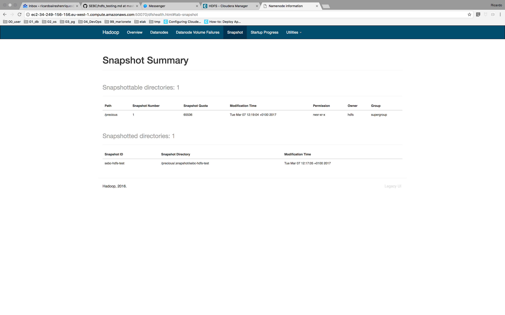

# Test HDFS Snapshots

1. Create a `precious` directory in HDFS; copy the ZIP course file into it.

    ```code
    hdfs dfs -mkdir /precious
    hdfs dfs -put /tmp/SEBC.zip /precious
    ```

1. Enable snapshots for precious

    ```code
    $ hdfs dfsadmin -allowSnapshot /precious
    Allowing snaphot on /precious succeeded
    $
    ```

1. Create a snapshot called `sebc-hdfs-test`

    ```code
    $ hdfs dfs -createSnapshot /precious sebc-hdfs-test
    Created snapshot /precious/.snapshot/sebc-hdfs-test
    $
    ```

1. Delete the directory

    ```code
    $ hdfs dfs -rm -r /precious
    rm: Failed to move to trash: hdfs://ip-172-31-16-248.eu-west-1.compute.internal:8020/precious: The directory /precious cannot be deleted since /precious is snapshottable and already has snapshots
    $
    ```

1. Delete the ZIP file

    ```code
    $ hdfs dfs -rm -r /precious/SEBC.zip
    17/03/07 11:18:18 INFO fs.TrashPolicyDefault: Moved: 'hdfs://ip-172-31-16-248.eu-west-1.compute.internal:8020/precious/SEBC.zip' to trash at: hdfs://ip-172-31-16-248.eu-west-1.compute.internal:8020/user/hdfs/.Trash/Current/precious/SEBC.zip
    $
    ```

1. Restore the deleted file

    ```code
    hdfs dfs -cp /precious/.snapshot/sebc-hdfs-test/SEBC.zip /precious
    ```

1. Capture the NameNode web UI screen that lists snapshots in storage/labs/2_snapshot_list.png.

    